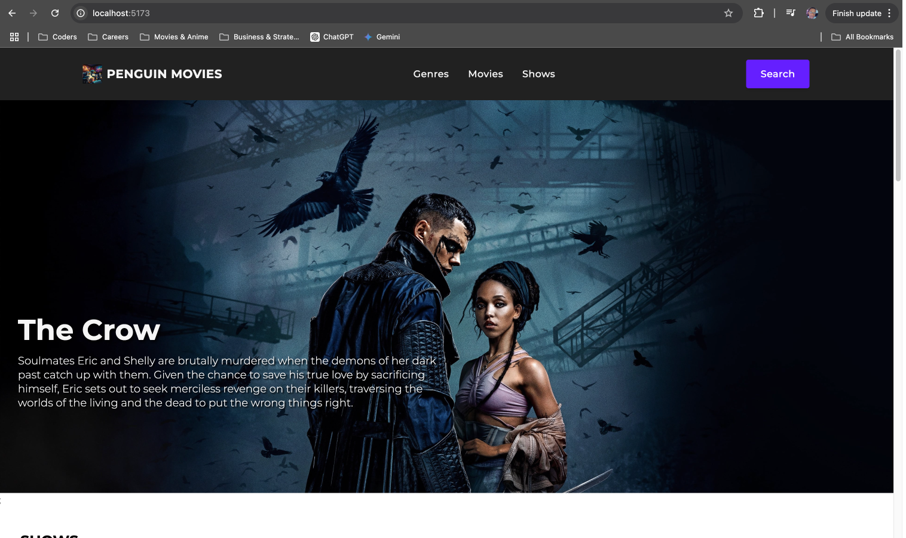

# Pengiun movie

[https://pengiun-movies.vercel.app/](https://pengiun-movies.vercel.app/)

This app is my attempt to get familiar with React + TypeScript + Vite. It tries to replicate the netflix ui. Thanks to YuriCPS for his work on [netflix-ui-tailwind](https://github.com/YuriCPS/netflix-ui-tailwind-stydcpnts/) and to Kitwind on [Kometa UI Kit](https://kitwind.io/products/kometa/)

This is still a work in progress.

## Screenshots

## Requirements

A free TMD API TOKEN is required for this application. One can be gotten from https://developer.themoviedb.org.

## To run

- npm install
- create a `.env` file and add `VITE_TMDB_TOKEN` which is the API token from TMDB
- npm run dev
